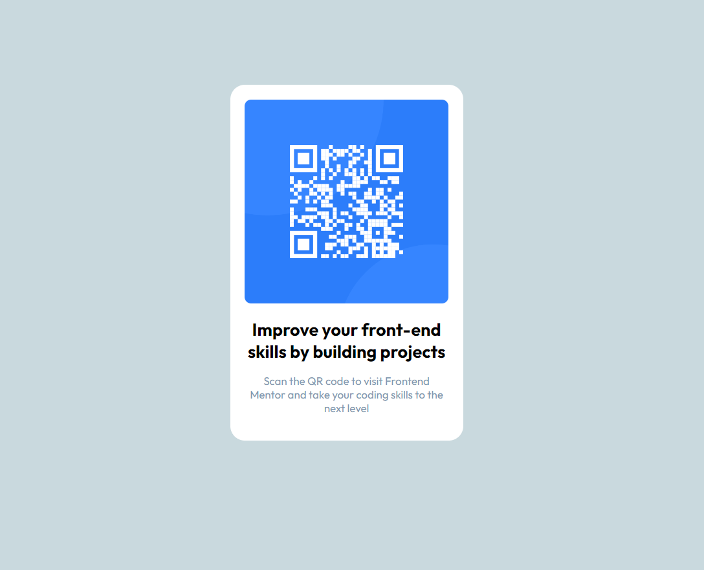

# Frontend Mentor - QR code component solution

This is a solution to the [QR code component challenge on Frontend Mentor](https://www.frontendmentor.io/challenges/qr-code-component-iux_sIO_H). Frontend Mentor challenges help you improve your coding skills by building realistic projects.

## Table of contents

- [Overview](#overview)
  - [Screenshot](#screenshot)
  - [Links](#links)
- [My process](#my-process)
  - [Built with](#built-with)
  - [What I learned](#what-i-learned)
  - [Continued development](#continued-development)
  - [Useful resources](#useful-resources)
- [Author](#author)
- [Acknowledgments](#acknowledgments)

## Overview

### Screenshot



### Links

- Solution URL: [Add solution URL here](https://github.com/Dev-Farhan/QR-code-component)
- Live Site URL: [Add live site URL here](https://qr-code-component-pied-seven.vercel.app/)

## My process

### Built with

- Semantic HTML5 markup
- CSS custom properties
- Flexbox
- CSS

### What I learned

Working on this project, I improved my understanding of using flexbox for layout alignment and responsive design. Here are some code snippets that I am proud of:

To see how you can add code snippets, see below:

```html
<div class="main">
  <div class="content">
    <div class="qr-code">
      
    </div>
    <div class="qr-content">
      <h2>Improve your front-end skills by building projects</h2>
      <p>
        Scan the QR code to visit Frontend Mentor and take your coding skills to
        the next level
      </p>
    </div>
  </div>
</div>
```

```css
body {
  display: flex;
  align-items: center;
  justify-content: center;
  background-color: rgb(201, 217, 222);
  font-family: "Outfit", sans-serif;
}

.main {
  max-width: 20rem;
  min-height: 30rem;
  background-color: #fff;
  padding: 20px;
  margin: 200px 0px;
  border-radius: 20px;
}

.qr-code img {
  max-width: 17.5rem;
  min-height: 15rem;
  border-radius: 9px;
}
```

### Continued development

In future projects, I plan to further explore CSS Grid for more complex layouts and to enhance my skills in responsive design. Additionally, I aim to delve into JavaScript frameworks like React to create more dynamic and interactive web components.

### Useful resources

CSS Tricks - A Complete Guide to Flexbox - This helped me understand flexbox concepts and implement them effectively in my project.
MDN Web Docs - Responsive design - This is an excellent resource for learning about responsive design principles and techniques.

## Author

- Frontend Mentor - [@Dev-Farhan](https://www.frontendmentor.io/profile/Dev-Farhan)
- LinkedIn - [Mohammad Farhan](https://www.linkedin.com/in/mohd-farhan0678/)

## Acknowledgments

I would like to thank the Frontend Mentor community for their continuous support and feedback, which greatly helped me improve my project.
